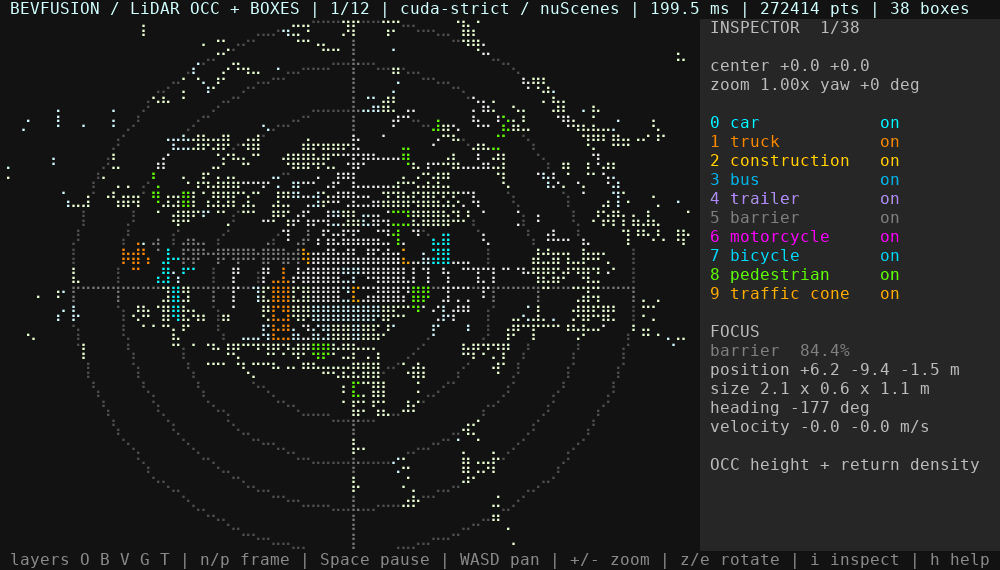

<p align="center">
  
</p>

<h1 align="center">BEVFusion.c</h1>

<p align="center">
  An auditable C11/CUDA inference path from six cameras and LiDAR to canonical
  3D detections.
</p>

[](docs/bevfusion-demo.gif)

**Technical article:** [hova88.github.io/bevfusion.c](https://hova88.github.io/bevfusion.c/)

BEVFusion.c implements a frozen six-camera Swin/LSS branch, sparse LiDAR
branch, BEV fusion, TransFusion decoder, metric decode, and rotated filtering.
The runtime has two deliberately different backends:

- **Portable CPU path:** C11 + POSIX APIs, with optional OpenMP and
  Accelerate/OpenBLAS dispatch. It builds on WSL, Linux, and macOS; a
  switchable scalar route remains the numerical oracle.
- **CUDA production path:** NVIDIA CUDA, cuBLAS, and cuDNN. It keeps weights and
  intermediate tensors resident on the GPU. This is the smooth demo path for
  Linux, WSL2, and Jetson.

No dataset, model, Python package, or CUDA installation is required to compile
the CPU binary and run the dependency-free tests.

## Download the checkpoint before the full tutorial

The build-only tests do not need model weights. Sections 3–5, model export,
full oracle validation, and the real demo all use this exact checkpoint:

**[Download `cbgs_bevfusion.pth` from Google Drive](https://drive.google.com/file/d/1X50b-8immqlqD8VPAUkSKI0Ls-4k37g9/view?usp=share_link)**

Save it with this filename before preparing demo data:

```sh
export NUSCENES_ROOT=/data/nuscenes  # choose any writable dataset root
mkdir -p "$NUSCENES_ROOT/checkpoints"
# Save the browser download as:
# $NUSCENES_ROOT/checkpoints/cbgs_bevfusion.pth
```

The file is hosted externally and is not covered by this repository's MIT
License. The exporter validates its tensor names and shapes before producing a
BFW runtime model.

## 1. First build on a new machine

Requirements: a C11 compiler, `make`, and a POSIX host. CMake 3.18+ is optional.

```sh
git clone https://github.com/hova88/bevfusion.c.git
cd bevfusion.c
make doctor
make test
```

`make` builds the CPU binary and adds the CUDA binary only when both `nvcc` and
cuDNN development headers are detected. The behavior is controllable:

```sh
make ENABLE_CUDA=0                 # portable CPU only
make ENABLE_CUDA=1 CUDA_ARCH=sm_87 # require CUDA; example for Jetson Orin
make ENABLE_OPENMP=0 ENABLE_BLAS=0 # minimum-dependency scalar build
make NATIVE=1                      # optional machine-local CPU instructions
```

The default CPU flags do not use `-march=native`, so binaries are not silently
tied to the build machine.

### CMake equivalent

```sh
cmake --preset cpu-release
cmake --build --preset cpu-release -j
ctest --preset cpu-release
```

For a required CUDA build:

```sh
cmake --preset cuda-release
cmake --build --preset cuda-release -j
```

If architecture auto-detection is unavailable, add
`-DBF_CUDA_ARCHS=87` (Orin), `72` (Xavier), or the compute capability of your
GPU to the CMake configure command. See [the complete platform and build
guide](docs/BUILDING.md) before installing CUDA packages.

## 2. Choose the dependency layer you need

| Goal | Runtime/build dependencies | Python dependencies | External assets |
|---|---|---|---|
| Build + unit tests | C11 compiler, `make` or CMake | none | none |
| Pack an existing NPZ | same | NumPy | NPZ frame |
| Prepare nuScenes frames | same | NumPy, Pillow, nuScenes devkit | nuScenes mini/full |
| Export a checkpoint | same | PyTorch | matching checkpoint |
| CUDA inference/demo | CUDA toolkit, cuBLAS, cuDNN | data/export layers above | BFW model + BFI frames |
| Full oracle validation | CPU/CUDA stack as selected | PyTorch | checkpoint + nuScenes |

Create an isolated environment for offline tools:

```sh
python3 -m venv .venv
. .venv/bin/activate
python -m pip install --upgrade pip
python -m pip install -r requirements/demo.txt
```

Install PyTorch only when exporting a checkpoint or generating oracle files:

```sh
python -m pip install -r requirements/export.txt
```

Jetson users should install the NVIDIA-provided PyTorch build that matches
their JetPack release instead of assuming the generic wheel is compatible.
The C/CUDA runtime itself does not link to PyTorch or the nuScenes devkit.

## 3. Arrange nuScenes and the checkpoint

The root is configurable; it is not hard-coded to `/data`. Make uses
`/data/nuscenes` when that directory exists and otherwise falls back to
`$HOME/datasets/nuscenes`:

```text
$NUSCENES_ROOT/
├── samples/
├── sweeps/
├── v1.0-mini/
├── checkpoints/
│   └── cbgs_bevfusion.pth
└── bevfusion-demo/        # generated; BFW, BFI, manifest
```

Download [`cbgs_bevfusion.pth`](https://drive.google.com/file/d/1X50b-8immqlqD8VPAUkSKI0Ls-4k37g9/view?usp=share_link)
first and place it at the path shown above. Download nuScenes mini from the [official nuScenes download
page](https://www.nuscenes.org/download), accept its license, and extract the
sensor data and `v1.0-mini` metadata into the same root. The checkpoint is a
separate externally licensed asset and must match the tensor names and shapes
in `cfgs/bevfusion.yaml`; the repository never downloads it silently.

Point the commands at any location:

```sh
export NUSCENES_ROOT=/data/nuscenes
make doctor
make demo-data NUSCENES_ROOT="$NUSCENES_ROOT"
make model NUSCENES_ROOT="$NUSCENES_ROOT"
```

`demo-data` deterministically creates twelve BFI frames from ten LiDAR sweeps
and the six cameras. `model` converts the PyTorch state dictionary into the
mmap-friendly, versioned, checksummed BFW container. Detailed dataset checks
and one-frame commands are in [the data preparation guide](docs/DATA.md).

## 4. Run inference and the viewer

```sh
MODEL="$NUSCENES_ROOT/bevfusion-demo/bevfusion.bfw"
FRAME="$NUSCENES_ROOT/bevfusion-demo/frame-000.bfi"

./build/bevfusion inspect "$MODEL"
./build/bevfusion frame-info "$FRAME"
./build/bevfusion plan "$MODEL" 300000 160000 160000
./build/bevfusion infer "$MODEL" "$FRAME"          # optimized CPU path
BF_CPU_SCALAR=1 ./build/bevfusion infer "$MODEL" "$FRAME" # scalar oracle
BF_CPU_PROFILE=1 ./build/bevfusion infer "$MODEL" "$FRAME" # stage timings
./build/bevfusion_cuda infer-cuda "$MODEL" "$FRAME" # GPU path
./build/bevfusion_cuda tui-cuda "$MODEL" \
  "$NUSCENES_ROOT"/bevfusion-demo/frame-*.bfi
```

Both inference commands emit the same canonical JSON detection schema. The TUI
renders measured LiDAR occupancy and those decoded boxes through one metric
transform. Use `o/b/v/g/t` for occupancy, boxes, velocity, rings, and trails;
`i` for the inspector; `WASD` to pan; `+/-` to zoom; and `z/e` to rotate.

## 5. Validation levels

```sh
make test       # fast: no data/model/Python/CUDA
make test-full  # CPU stage oracles; requires checkpoint + PyTorch
make cuda-test  # CUDA stage and end-to-end gates; also requires demo data
```

These commands intentionally separate three claims:

1. container and operator correctness;
2. end-to-end graph equivalence on identical inputs;
3. dataset accuracy using the official nuScenes evaluator.

This repository currently publishes the first two. It does **not** claim an
official nuScenes mAP/NDS from the local BFI demo because BFI v1 omits the
global sample metadata needed by the official evaluator.

## Measured performance, not a portability promise

On the recorded RTX 4060 Ti real frame, the strict CUDA graph measured about
146 ms warm with 1118.71 MiB of owned residency. It transferred 18,426,080
input bytes, retained intermediate activations on device, and returned one
8,804-byte detection structure. All 200 detections matched the scalar oracle
by class and nearest center; maximum center error was 1.823 mm.

Those are hardware-specific five-process medians. On one WSL2/Linux host with
an i5-14600KF and 16 OpenMP threads, the optimized portable CPU graph reduced a
272,414-point real frame from 209.32 s scalar to 11.71 s in one monotonic-clock
profile. It still uses a 342.02 MiB caller-owned arena and is **not** a
real-time CPU backend.

The measured CPU time is concentrated in the frozen model's dense compute:

| Stage | Time | Share | Why it dominates |
|---|---:|---:|---|
| Dense BEV fusion/backbone | 6.11 s | 52% | repeated wide 3×3 convolutions on a 180×180 grid |
| Swin-T camera backbone | 3.48 s | 30% | six images, window attention, projections and FFNs |
| Sparse LiDAR backbone | 0.80 s | 7% | 21 sparse convolutions and coordinate lookup |
| Remaining camera/LSS/decode | 1.32 s | 11% | FPN, depth, lift-splat, downsample and output decode |

This is why further portable-C micro-tuning is no longer the primary roadmap.
For CPU-oriented deployment, the larger gains are expected from a smaller or
distilled image backbone, fewer camera pixels/depth bins, a coarser BEV grid,
a narrower/pruned BEV backbone, and calibrated INT8/FP16 weights. Those changes
alter the trained graph and therefore require retraining or fine-tuning,
re-export, complete oracle checks, and nuScenes evaluation. The current
checkpoint remains the correctness baseline; Linux/WSL/Jetson real-time use is
expected to take the CUDA path. The evidence and rejected optimization
candidates are recorded in
[`benchmark.csv`](benchmark.csv) and
[`runs/rtx4060ti-2026-07-18`](runs/rtx4060ti-2026-07-18/README.md).

## Learn the graph

- [Interactive technical article](docs/index.html) — BEVFusion, tensor pipe,
  operator decomposition, optimization story, and visual explanations.
- [Publishing the article](docs/PUBLISHING.md) — enable the `docs/` directory
  as a zero-build GitHub Pages site.
- [Engineering wiki](wiki/Home.md) — contracts, graph, residency, branches,
  correctness funnel, viewer, and profiling workflow.
- [Portability review](docs/PORTABILITY.md) — what is portable now, remaining
  platform risks, and the acceptance matrix.

The checked-in GIF is generated from twelve real nuScenes mini frames through
the CUDA inference/compositor path. Occupancy is measured multi-sweep LiDAR
input, not a synthetic scene or semantic occupancy prediction.

## License

BEVFusion.c is released under the [MIT License](LICENSE). nuScenes data,
checkpoints, CUDA, cuDNN, PyTorch, and other external components retain their
own licenses and terms.
