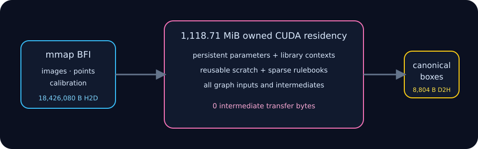

# Residency and transfers

Memory is an architectural property here, not an incidental allocator trace.
Contexts own parameters, library workspaces, sparse rulebooks, and reusable
scratch. The full CUDA runtime also owns every graph boundary tensor.

## Recorded production boundaries

| Scope | Recorded residency | Meaning |
|---|---:|---|
| Swin strict route | 216.27 MiB | Context plus bounded attention/FFN storage |
| Camera neck plus LSS contexts | 156.33 MiB | Reusable contexts, excluding explicit slice tensors |
| Complete camera branch | 472.95 MiB | Contexts plus explicit production boundaries |
| LiDAR branch | 323.57 MiB | 284.53 MiB contexts plus 39.04 MiB boundaries |
| Complete BFI-to-detections runtime | 1118.71 MiB | All contexts, parameters, inputs, and intermediates |

These values are **measured/accounted** by explicit byte counters on the
2026-07-18 RTX 4060 Ti run. They are not `nvidia-smi` process deltas. The
allocation inventory lives in [`src/cuda_runtime.cu`](../src/cuda_runtime.cu),
and each module exposes a resident-byte query.

Per frame, the full graph copies 18,426,080 bytes H2D: normalized cameras,
points, and calibration. It copies 8,804 bytes D2H for detections and zero
graph-intermediate bytes. The scalar path instead uses one caller-owned 342.02
MiB workspace at the default capacities.

## Why workspace caps are measured

The camera cuDNN selection accepts a default 16 MiB workspace ceiling.
**Measured:** the capped algorithm reduced FPN plus depth from 9.467 ms and
322.88 MiB to 5.827 ms and 96.70 MiB on the recorded system. The smaller route
was also faster, so it was promoted; the environment override remains a
deliberate experiment knob in [`src/cuda_camera.cu`](../src/cuda_camera.cu).
