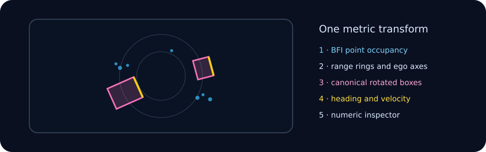

# Terminal viewer

The viewer is a projection of runtime data, not an alternate inference path.
It borrows the validated BFI point mapping for the lifetime of the session and
draws input occupancy beneath canonical decoded boxes.

Occupancy bins the same `[P,5]` points by metric location. Height, intensity,
timestamp, and per-cell density select color and Braille weight. It is input
occupancy and is never labeled as a semantic occupancy prediction.

Boxes use the model's metric `dx`, `dy`, yaw, velocity, score, and class. The
first footprint dimension follows yaw and the second is lateral. Bold,
class-colored outlines preserve the LiDAR points underneath; the heading edge
is distinct. The inspector
shows the selected box numerically. Range rings, short trails, filtering,
pan/zoom/rotation, and all box layers share one transform in
[`src/tui.c`](../src/tui.c).

The compositor has an exact terminal contract:

- output contains exactly the requested number of rows;
- no rendered row exceeds the requested column count;
- widths below 80 columns omit the sidebar;
- screens below 32 by 10 use a deterministic minimal view;
- split escape sequences remain valid input events;
- every canvas cell resets its background, preventing sidebar color leakage.

[`tests/test_tui.c`](../tests/test_tui.c) checks deterministic composition,
occupancy toggles, sparse/dense brightness, focus details, invalid strides,
and a 20–160 by 5–40 layout matrix. `make demo` feeds the same compositor with
twelve real CUDA-inferred nuScenes frames from `/data/nuscenes/bevfusion-demo`.
