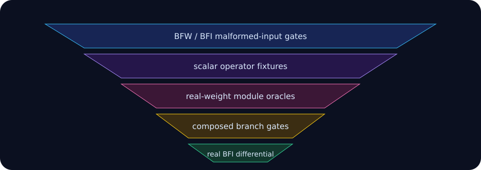

# Correctness funnel

Correctness is promoted in layers. A fast full-frame comparison alone cannot
localize an error, while isolated operator tests alone cannot prove graph
wiring or transfer behavior.

1. Container tests reject malformed BFW and BFI headers, lengths, layouts,
   CRCs, overflow, and non-finite values.
2. Scalar operator fixtures cover convolution, rasterization, lift-splat,
   shifted-window attention, and decoder primitives.
3. Saved real-weight PyTorch oracles gate each major module.
4. Composed camera, LiDAR, and detection-tail tests catch layout and ownership
   mistakes between modules.
5. The complete real BFI differential compares canonical outputs, checks
   repeat determinism, and records boundary traffic.
6. Portable C11 and ASan/UBSan runs audit the CPU path independently of native
   optimization.

The full audit is recorded in
[`validation.txt`](../runs/rtx4060ti-2026-07-18/validation.txt). Compute
Sanitizer is explicitly **unavailable**, not passed: the installed 2024.1.1
tool reports an unsupported debugger/device combination before instrumentation.
Likewise, official nuScenes mAP/NDS is not claimed because the local BFI demo
sequence omits the global result metadata required by the evaluator.

This distinction matters. Oracle agreement establishes implementation fidelity
to the exported graph; it does not establish dataset-level model quality.
