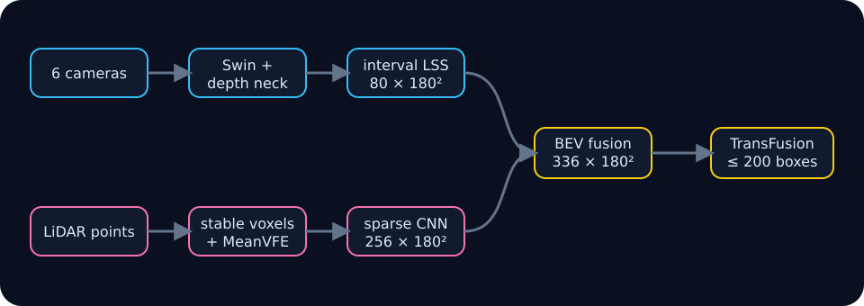

# BEVFusion.c engineering notes

BEVFusion.c is a small C11/CUDA inference runtime for one frozen six-camera
and LiDAR BEVFusion checkpoint. The project is designed around an auditable
boundary: a checksummed BFI frame enters, one fixed graph executes, and a
canonical `bf_detections` value leaves. Python prepares assets and oracles; it
is not part of inference or the terminal viewer.

The scalar CPU path is the portable oracle. The CUDA path keeps graph
intermediates resident and uses strict FP32 math where the saved oracle gates
require it. The demo and checked-in GIF use the deterministic real nuScenes
sequence prepared under `/data/nuscenes/bevfusion-demo`.

## Repository map

| Area | Responsibility |
|---|---|
| [`src/frame.c`](../src/frame.c) | Validated, mmap-backed BFI input |
| [`src/runtime.c`](../src/runtime.c) | Scalar graph and workspace ownership |
| [`src/cuda_runtime.cu`](../src/cuda_runtime.cu) | Full device graph and boundary transfers |
| [`src/cuda_swin.cu`](../src/cuda_swin.cu) | Six-camera Swin-T backbone |
| [`src/cuda_lss.cu`](../src/cuda_lss.cu) | Deterministic lift-splat intervals |
| [`src/cuda_voxel.cu`](../src/cuda_voxel.cu) | Stable voxel grouping and MeanVFE |
| [`src/cuda_lidar.cu`](../src/cuda_lidar.cu) | Sparse LiDAR backbone and dense scatter |
| [`src/cuda_transfusion.cu`](../src/cuda_transfusion.cu) | Proposal selection, decoder, and canonical boxes |
| [`src/tui.c`](../src/tui.c) | Metric BEV occupancy and box compositor |

## Chapters

1. [Model and frame contract](01-model-and-frame-contract.md)
2. [Execution graph](02-execution-graph.md)
3. [Residency and transfers](03-residency-and-transfers.md)
4. [Camera branch](04-camera-branch.md)
5. [LiDAR branch](05-lidar-branch.md)
6. [Fusion and TransFusion](06-fusion-and-transfusion.md)
7. [Terminal viewer](07-terminal-viewer.md)
8. [Correctness funnel](08-correctness-funnel.md)
9. [Performance workflow](09-performance-workflow.md)

The dated [real nuScenes KDA audit](../runs/rtx4060ti-nuscenes-real-2026-07-18/README.md) is the
source of measured CUDA numbers. It is evidence for that hardware and software
stack, not a portable performance promise.
